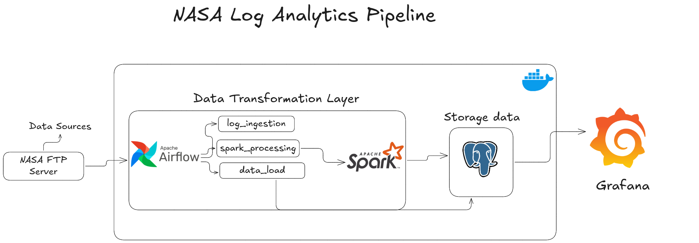
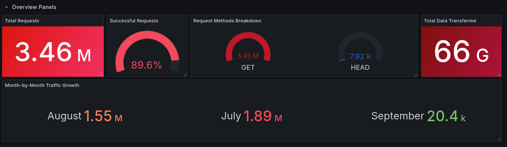

# NASA Log Analytics Pipeline

This project implements an end-to-end log analytics pipeline that processes NASA HTTP server logs from July 1995 using Apache Airflow, Apache Spark, and PostgreSQL. The processed data is then visualized using Power BI.

## Project Ovrview

This pipeline analyzes NASA's web server logs from July to September 1995, containing:
- HTTP request timestamps
- Client host information
- Request methods and paths
- HTTP status codes
- Response sizes
- Monthly traffic patterns
- Error rate analysis

## Pipeline Architecture



## Project Structure

```
log-analytics-pipeline/
│── dags/                   
│   ├── log_ingestion.py      # Downloads NASA HTTP logs
│   ├── spark_processing.py   # Processes logs using Spark
│   ├── data_load.py         # Loads processed data into PostgreSQL
│
│── spark_jobs/               
│   ├── process_logs.py       # Spark job for log analysis
│
│── sql/                       
│   ├── create_tables.sql     
│
│── reports/                   
│   ├── log_analytics.pbix    
│ 
│── requirements.txt         
``` 

## Spark Analysis Summary

<div align="center">

###  Log Analysis Summary 

|                   Metric                   |          Value          |
|-------------------------------------------|-------------------------|
| ** Total Requests**                      | 3,461,612               |
| ** Unique Hosts**                        | 137,978                 |
| ** Total Data Transferred**              | 61.02 GB                |
| ** Average Response Size**               | 18,928.84 bytes         |

</div>

### Processing Statistics 

<table>
<tr>
  <th>Log File</th>
  <th>Valid Entries</th>
  <th>Status</th>
</tr>
<tr>
  <td>NASA_access_log_Aug95.log</td>
  <td>1,569,898</td>
  <td>Processed</td>
</tr>
<tr>
  <td>NASA_access_log_Jul95.log</td>
  <td>1,891,714</td>
  <td> Processed</td>
</tr>
<tr>
  <td><strong>Total</strong></td>
  <td><strong>3,461,612</strong></td>
  <td> Complete</td>
</tr>
</table>

## Prerequisites

- Python 3.8+
- Apache Airflow 2.x
- Apache Spark 3.x
- PostgreSQL 13+
- Power BI

<!-- ## Performance Metrics



## Error Analysis

 -->

## Analysis Features

1. Basic Statistics:
- Total requests per month
- Unique visitors
- Data transfer volumes
- Average response sizes

2. Traffic Analysis:
- Hourly request patterns
- Most requested paths
- Error rate analysis
- Status code distribution

3. Monthly Comparisons:
- Traffic patterns across months
- Error rates comparison
- Resource usage trends


## Airflow DAGs

1. `data_load.py`:
- Loads raw logs into PostgreSQL
- Creates necessary tables and indexes
- Handles data validation

2. `log_ingestion.py`:
- Manages the complete log processing workflow
- Schedules regular data updates
- Monitors processing status

3. `spark_processing.py`:
- Handles Spark processing for large datasets
- Schedules regular processing
- Monitors processing status

## Future Improvements

1. Add data validation and cleaning steps
2. Implement automated testing
3. Add visualization dashboard
4. Include more advanced analytics:
   - User behavior analysis
   - Geographic distribution
   - Performance metrics
   - Anomaly detection
5. Add Airflow sensors for file monitoring
6. Implement parallel processing for large log files

