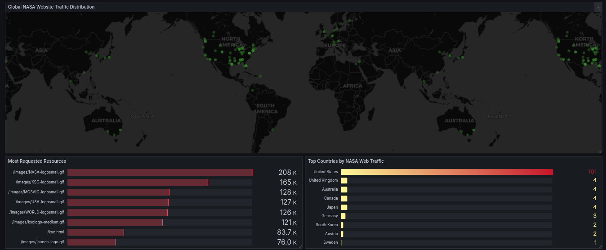

# NASA Log Analytics Pipeline

This project implements an end-to-end log analytics pipeline that processes NASA HTTP server logs from July 1995 using Apache Airflow, Apache Spark, and PostgreSQL. The processed data is then visualized using Grafana.

## Project Ovrview

This pipeline analyzes NASA's web server logs from July to September 1995, containing:

- HTTP request timestamps
- Client host information
- Request methods and paths
- HTTP status codes
- Response sizes
- Monthly traffic patterns
- Error rate analysis

## Pipeline Architecture

## Analysis Summary

### Log Analysis Summary

| Metric | Value |
|--------|-------|
| Total Requests | 3,461,612 |
| Unique Hosts | 137,978 |
| Total Data Transferred | 61.02 GB |
| Average Response Size | 18,928.84 bytes |

### Processing Statistics

| Log File | Valid Entries 
|----------|---------------|
| NASA_access_log_Aug95.log | 1,569,898 |
| NASA_access_log_Jul95.log | 1,891,714 |
| Total | 3,461,612 | 

## Performance Metrics

## Global Traffic Distribution Map

 

## Analysis Features

1. Basic Statistics:

- Total requests per month
- Unique visitors
- Data transfer volumes
- Average response sizes

2. Traffic Analysis:

- Hourly request patterns
- Most requested paths
- Error rate analysis
- Status code distribution

3. Monthly Comparisons:

- Traffic patterns across months
- Error rates comparison
- Resource usage trends

## Future Improvements

1. Add data validation and cleaning steps
2. Implement automated testing
3. Add visualization dashboard
4. Include more advanced analytics:

   - User behavior analysis
   - Geographic distribution
   - Performance metrics
   - Anomaly detection
5. Add Airflow sensors for file monitoring
6. Implement parallel processing for large log files
